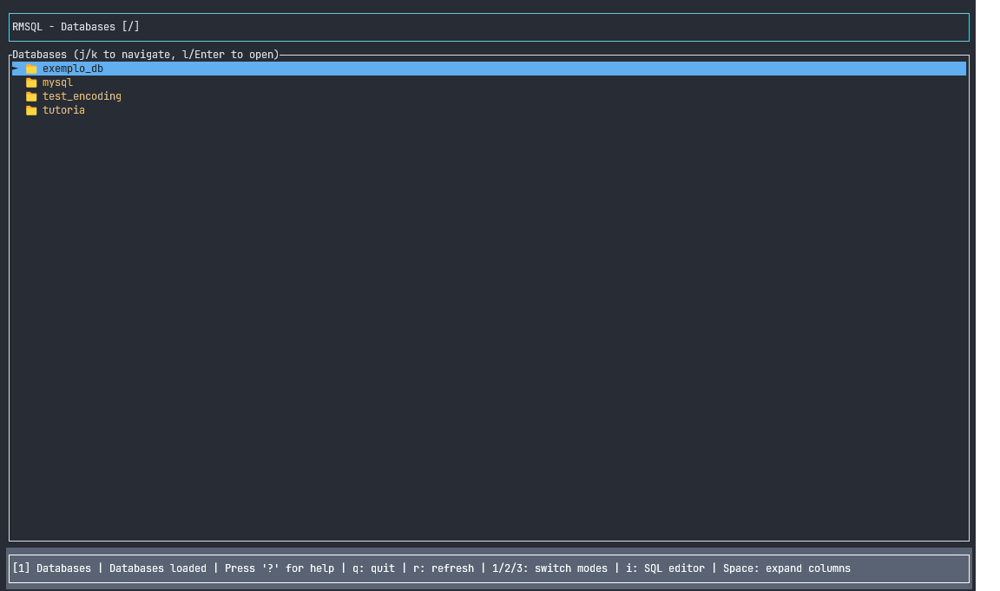

# RMSQL - Interactive MySQL Client (Vim-style)

<!-- Screenshot placeholder -->


## 📁 File System Structure

RMSQL organizes its data into:

### Configurations (`~/.config/rmsql/`)
- **`connections.json`**: Saved connections
- **`user_config.json`**: User settings and registered databases

### Cache (`~/.cache/rmsql/`)
- **`sql_history.json`**: Complete SQL command history

A modern, interactive MySQL client with a terminal interface inspired by Vim, built in Rust with advanced configuration and history systems.

## 🚀 Features

### ✨ Main Highlights

#### 1. Smart Configuration System
- **Auto-discovery** of databases
- **Persistent SQL command history**
- **Favorites** and quick access to frequent databases
- **User-customizable settings**

#### 2. Interactive SQL Editor
- **Key**: `i` (to enter editor mode)
- Type custom SQL queries
- **Features:**
    - Persistent query history across sessions
    - Navigate history with `↑`/`↓`
    - Execute with `Enter`
    - Supports all SQL queries (SELECT, INSERT, UPDATE, DELETE, etc.)
    - Performance metrics (execution time)
    - Detailed error messages

#### 3. Dynamic Column Expansion
- **Key**: `Space` (in data view mode)
- Toggle between normal and expanded column views
- In expanded view:
    - Horizontal navigation with `←`/`→`
    - Better for viewing long text data

#### 4. Advanced Connection Management
- Automatically saves used connections
- Intuitive interface for managing multiple connections
- Auto-reconnect on connection loss
- **SSL/TLS Support**: Toggle SSL encryption on/off per connection
- Compatible with MySQL/MariaDB servers with SSL disabled

#### Connection Form Fields
When creating or editing a connection, configure the following:
- **Name**: Display name for the connection
- **Host**: MySQL server hostname or IP address
- **Port**: MySQL server port (default: 3306)
- **Username**: MySQL user account
- **Password**: User password (not saved for security)
- **Database**: Optional default database to select
- **Use SSL**: Enable/disable SSL encryption (default: enabled)
  - Set to "No" for servers with SSL disabled
  - Equivalent to `mysql --ssl=false` in CLI

## 📁 File System Structure

RMSQL organizes its data into:

### Configurations (`~/.config/rmsql/`)
- **`connections.json`**: Saved connections
- **`user_config.json`**: User settings and registered databases

### Cache (`~/.cache/rmsql/`)
- **`sql_history.json`**: Complete SQL command history

## Prerequisites

1. **MySQL Server** running locally
2. **Rust** installed (version 1.70 or higher)
3. **Configured MySQL connection**

## MySQL Setup (if needed)

To allow root connection without password locally:

```sql
-- Connect to MySQL as root
mysql -u root -p

-- Run the commands:
ALTER USER 'root'@'localhost' IDENTIFIED WITH mysql_native_password BY '';
FLUSH PRIVILEGES;
```

## Installation

1. Clone the repository:
     ```bash
     git clone https://github.com/rafaelsieber/rmsql.git
     cd rmsql
     ```

2. Build the project:
     ```bash
     cargo build --release
     ```

## Usage

### Run as root (recommended)
```bash
sudo ./target/release/rmsql
```

### Run with specific user
```bash
./target/release/rmsql -u your_user -p your_password
```

### Command-line options

```bash
./target/release/rmsql [OPTIONS]

Options:
    -h, --host <HOST>          MySQL host [default: localhost]
    -P, --port <PORT>          MySQL port [default: 3306]
    -u, --username <USERNAME>  MySQL username (default: root when running with sudo)
    -p, --password <PASSWORD>  MySQL password
    -d, --database <DATABASE>  Initial database to connect to
            --help                 Print help
```

## Interface & Navigation

### Vim-Inspired Commands

| Key         | Action                        |
|-------------|------------------------------|
| `j` or `↓`  | Move down                    |
| `k` or `↑`  | Move up                      |
| `h` or `←`  | Go back/navigate back        |
| `l` or `→` or `Enter` | Go forward/enter   |
| `g`         | Go to top                    |
| `G`         | Go to bottom                 |
| `r`         | Refresh current view         |
| `i`         | Enter SQL editor             |
| `Space`     | Toggle column expansion (data mode) |
| `q`         | Quit                         |
| `?`         | Show help                    |

### View Modes

| Key | Mode        | Description                        |
|-----|-------------|------------------------------------|
| `1` | Connections | Manage MySQL connections           |
| `2` | Databases   | List databases of active connection|
| `3` | Tables      | List tables of selected database   |
| `4` | Data        | Show data from selected table      |

### SQL Editor

In SQL editor mode (`i`):
- Type your SQL queries (all characters including 'q' work normally)
- `Enter`: Execute query
- `↑`/`↓`: Navigate command history
- `Esc`: Exit editor mode
- All queries are automatically saved to history

## 🔧 Advanced Features

### Smart History
- **Persistence**: SQL commands saved across sessions
- **Metrics**: Execution time for each query
- **Context**: Database and connection used
- **Filters**: History by connection or database
- **Limit**: Automatic history size control

### Customizable Settings
- **Auto-save history**: Enabled by default
- **Entry limit**: 1000 commands (configurable)
- **Confirmation**: For dangerous queries (DROP, DELETE)
- **Execution time**: Optional metrics display

### Database Management
- **Auto-discovery**: Databases saved automatically
- **Favorites**: Mark important databases
- **Last access**: Automatic tracking
- **Quick access**: For recent and favorite databases

## Features

- ✅ Intuitive vim-inspired interface
- ✅ Hierarchical navigation (Connections → Databases → Tables → Data)
- ✅ Interactive SQL editor with persistent history
- ✅ Advanced configuration system
- ✅ Query performance metrics
- ✅ Multiple connection management
- ✅ Auto-discovery and favorites for databases
- ✅ Dynamic column expansion
- ✅ Persistent command history
- ✅ Colorful and responsive interface

## Project Structure

```
src/
├── main.rs              # Entry point and main logic
├── database.rs          # MySQL connection and query management
├── navigation.rs        # Navigation state and mode control
├── ui.rs                # User interface with ratatui
├── connection_config.rs # Connection configuration management
├── connection_ui.rs     # Connection management UI
└── user_config.rs       # User configuration system
```

## 📊 Benefits

### For Developers
- **Persistent history**: Never lose important SQL commands
- **Performance analysis**: Identify slow queries
- **Context preserved**: Know where and when each command was run
- **Productive interface**: Fast vim-style navigation

### For DBAs
- **Auditing**: Complete activity tracking
- **Debugging**: Error history with full context
- **Efficiency**: Quick access to frequent databases
- **Multiple connections**: Manage several environments

### For Teams
- **Consistency**: Standardized configurations
- **Collaboration**: Easy sharing of settings
- **Security**: Control over dangerous queries

## Usage Examples

### Connect as root via sudo:
```bash
sudo ./target/release/rmsql
```

### Connect with specific credentials:
```bash
./target/release/rmsql -u admin -p mypassword -h 192.168.1.100
```

### Navigation:
1. Start the program
2. Use `j/k` to navigate databases
3. Press `Enter` on a database to see its tables
4. Press `Enter` on a table to view its data
5. Use `h` to go back to the previous level
6. Press `q` to quit

## Dependencies

- `mysql` - Native MySQL driver for Rust
- `ratatui` - Modern terminal UI framework
- `crossterm` - Cross-platform terminal control
- `anyhow` - Robust error handling
- `clap` - Elegant CLI argument parser
- `serde` - Data serialization/deserialization
- `chrono` - Date and time handling
- `dirs` - System directory access
- `uuid` - Unique identifier generation

## 🔐 Privacy & Security

- **Local only**: All data stays on the user's machine
- **Not shared**: No information sent to external servers
- **Full control**: User can clear history at any time
- **Clear separation**: Config and cache in proper directories
- **Secure passwords**: Not stored in plain text

## Current Limitations

- Shows up to 100 rows by default (configurable)
- Passwords are not saved for security
- Interface optimized for terminals at least 80 characters wide

## Roadmap

Planned features:
- [ ] Data export (CSV, JSON)
- [ ] Data import
- [ ] Schema editor
- [ ] Backup and restore
- [ ] PostgreSQL support
- [ ] Plugin system
- [ ] Customizable themes

## Troubleshooting

### Connection error
- Check if MySQL is running: `sudo systemctl status mysql`
- Test connection: `mysql -u root`
- Verify credentials

### Permission error
- Run with `sudo` to use root credentials
- Or specify user and password: `-u user -p password`

### Interface issues
- Make sure your terminal supports colors
- Resize the terminal if needed
- Some terminals may not support all special characters

